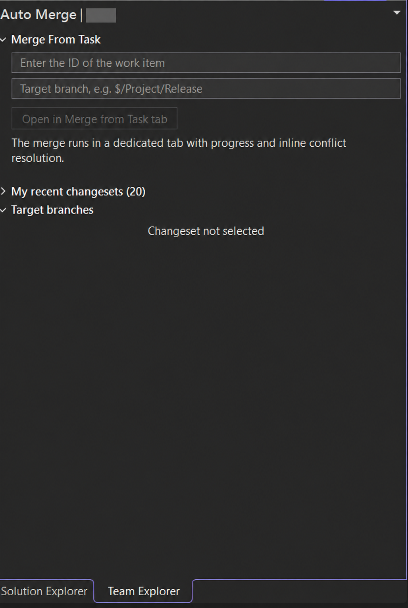
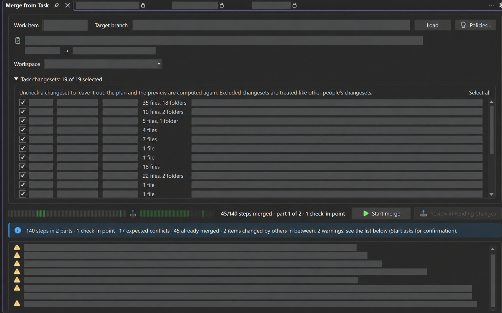
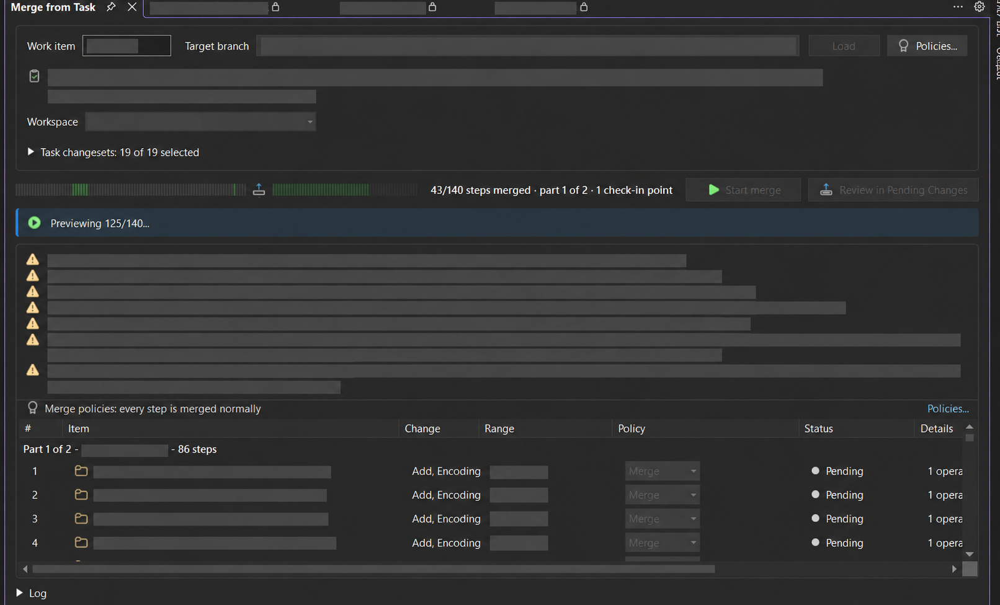
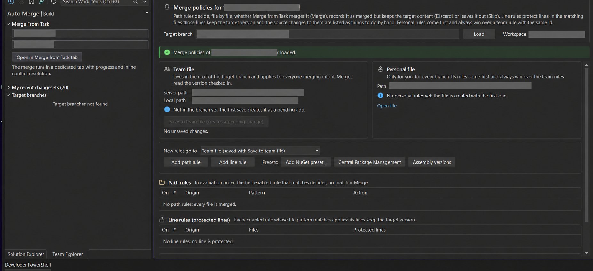

# MultiMerge

**Task-based transfers for both TFVC and Git, in one Visual Studio extension.**

[TFVC release on Visual Studio Marketplace](https://marketplace.visualstudio.com/items?itemName=lucapersichini.MultiMerge) · [Git 1.2.0 preview source](https://github.com/lucapersichini/MultiMerge/tree/feature/git-preview) · [Release notes](RELEASE_NOTES.md) · [Apache 2.0 license](LICENSE.txt)

MultiMerge detects whether the active Visual Studio context uses **TFVC or Git** and opens the matching workflow. In either mode, you choose the changes associated with a task, inspect the plan and resolve conflicts before completing the transfer. When the context is ambiguous, you choose the repository or TFVC project explicitly. It does not convert history between Git and TFVC.

## Highlights

- **Select a task's actual changes.** In TFVC, choose linked changesets; in Git, find commits by task ID in their messages or Azure Boards links. Review and adjust the selection before applying it.
- **See the transfer before it changes a branch.** TFVC shows a file-by-file plan, dependency warnings and check-in boundaries. Git previews selected commits for every target in isolated clones.
- **Keep branch-specific content under control.** Team and personal policies can merge, discard or skip paths and protect selected lines. The plan shows follow-ups that still need manual review.
- **Work through conflicts in Visual Studio.** Edit text conflicts in the dedicated view. Git transfers can resume after restarting Visual Studio; TFVC task merges guide you through each check-in point.
- **Deliver to multiple Git targets in order.** A conflict pauses before later branches are touched. Merge commits require an explicit parent choice, and no branch is pushed automatically.

| Mode | Changes selected | Destination and completion |
| --- | --- | --- |
| [**TFVC**](#tfvc-run-a-task-merge) | Work-item changesets | One target branch per task merge; review and check in each part. The original single-changeset workflow is also available. |
| [**Git**](#git-transfer-selected-commits) | Commits matched to a task or selected manually | One or more local target branches; preview each, apply in order, then build, test and push when ready. |

**Availability:** The dual-mode Git workflow is in the [1.2.0 preview branch](https://github.com/lucapersichini/MultiMerge/tree/feature/git-preview). The Marketplace link above is for the existing TFVC release; do not assume it contains the Git workflow yet.

Maintained by **Luca Persichini**. Based on [AutoMerge by Kulikov Denis (CDuke)](https://github.com/CDuke/AutoMerge), under the Apache License 2.0.

## Install

For the TFVC release, download MultiMerge from the [Visual Studio Marketplace](https://marketplace.visualstudio.com/items?itemName=lucapersichini.MultiMerge), close Visual Studio, install the VSIX, then reopen **Team Explorer → MultiMerge**.

For the Git 1.2.0 preview, check out [`feature/git-preview`](https://github.com/lucapersichini/MultiMerge/tree/feature/git-preview), build the Release VSIX using the command below, close Visual Studio and install it. Open MultiMerge in a Git solution to use the Git workflow. A repository with both providers or no clear context asks you to choose.

The TFVC workflow has been tested on **Visual Studio 2026 Professional / Enterprise on Windows (64-bit)**; it needs a workspace that maps the target branch. The Git preview has been built and tested with Visual Studio 2026 tooling and a WPF host, but still needs validation inside the installed IDE. The Marketplace manifest also permits Visual Studio 2022 17.14+, which has not yet been validated by the maintainer.

## A look at the TFVC workflow

The screenshots below have identifying project, user and changeset details redacted. They were captured before the MultiMerge rename, so some panels still show the former **Auto Merge** name.

### 1. Open a task merge from Team Explorer

Enter the work item ID and target branch, then open the dedicated merge tab.



### 2. Choose the changesets to include

Review the changesets associated with the work item. Use Ctrl/Shift to highlight multiple rows and include or exclude them together, or change individual checkboxes. Press **Update plan** once after making your choices.



### 3. Review the plan and track progress

Inspect the file-by-file plan, dependency warnings, progress and check-in boundaries before proceeding through the merge.



### 4. Configure team and personal policies

Choose which files to merge, discard or skip, and which lines to preserve. Presets help configure package references and assembly versions.



## TFVC: run a task merge

1. Open **Team Explorer → MultiMerge → Merge From Task**.
2. Select a work item and target branch, then open the **Merge from Task** tab.
3. Choose the changesets to include and press **Update plan**. Review the updated plan and configure **Merge Policies** as needed.
4. Start the merge and resolve conflicts. The warnings window can be resized or minimized while you inspect Visual Studio; the merge waits for confirmation.
5. Build and test the target branch before confirming each check-in. Comments are prefilled with the task, changeset IDs and original comments of the changesets delivered in that part. Continue until all parts are complete.
6. Review the manual follow-ups and update branch-specific packages through your normal process.

## TFVC policies

Team rules live in `.automerge-policy.json` at the target branch root. The existing filename is retained for compatibility with policies created before the rename. Save and check in that file separately before starting the merge.

Personal rules live in `%APPDATA%\MultiMerge\merge-policy.personal.json`. The existing `%APPDATA%\AutoMerge` policy file is copied on first use if no MultiMerge file exists. Personal rules take precedence over team rules.

| Action | Content | TFVC merge history |
| --- | --- | --- |
| Merge | Merge changes, preserving configured protected content | Recorded through the merge workflow |
| Discard | Keep target content | Record the merge as discarded |
| Skip | Leave the file alone | No merge recorded |

Legacy single-changeset preferences are copied from `%APPDATA%\Visual Studio Auto Merge\automerge.conf` to `%APPDATA%\Visual Studio MultiMerge\multimerge.conf` on first use.

## TFVC limits

- One target branch per task merge.
- A work item link does not prove that the task contains all of its code dependencies.
- The extension does not build the application or choose the correct conflict resolution for you.
- Task merges stop on unsupported operations such as renames, branching, rollback or undelete.
- Resuming a merge chain after closing Visual Studio is not currently supported.

## Git: transfer selected commits

The Merge from Task window automatically shows Git or TFVC when the current solution has one clear context. When it is ambiguous, choose the repository or connected TFVC project explicitly. The context is locked during active transfers.

1. Choose the local source and first target branch. Additional targets can be entered separated by semicolons; they are processed in order.
2. Load the commits. Enter a task ID and use Select task commits to propose commits whose messages reference the exact ID or which Azure Boards links to that work item. Review the checkboxes and dependencies; selection never starts a transfer.
3. For a merge commit, enter the parent number to use as its mainline. Use Policies to edit and validate the target team policy and personal policy. Update plan previews each target in an isolated clone.
4. Review every plan and Apply selected commits. A conflict pauses the batch before later targets are touched. Nothing is pushed automatically.
5. For text conflicts, edit the result, Save and stage, then Continue. Binary and structural conflicts require an external Git tool. Abort cancels the current pick, while already completed targets and commits remain.

Git policies use the same JSON schema as TFVC. The team file is .automerge-policy.json committed on each target branch. The personal file is under %APPDATA%\MultiMerge\git-policy.personal.json and overrides matching team rules. Merge applies changes; Discard retains target content while recording provenance; Skip omits changes. Protected-line rules retain matching target lines, with unsafe results blocked at preview. Saving a team policy from the editor creates a local change that you must commit before Update plan.

The extension saves an active transfer journal in the repository's Git directory. Reopen the repository after restarting Visual Studio to recover a paused transfer. Recovery refuses changed branches, policies or unexpected cherry-picks. Git for Windows and a configured author identity are required. The working tree must be clean before application. Commit discovery considers the latest 200 source commits that are missing from at least one selected target; Azure Boards lookup recognizes Git commit artifacts but does not infer code dependencies. A multi-target run is sequential and not atomic: earlier completed targets remain if a later target stops. Merge commits require an explicit mainline choice. Build and test each target before pushing.

## Build and tests

The Git workflow was built with Visual Studio 2026 MSBuild and all 366 automated tests passed with VSTest, including real Git repositories for policy decisions, task lookup, multi-target transfers, merge parents, and recovery. A WPF integration run passed 16 checks against synthetic fixtures from the private Git laboratory: task selection, two target branches, application, compilation of the result, conflict resolution, and restart recovery. A separate 11-check WPF/context run validated the single-workflow host, transfer locking, ambiguous repositories and linked Git worktrees. These runs host the compiled views and view models outside Visual Studio; validation inside the installed IDE is still pending. The maintainer has also exercised the TFVC workflow in their own environment. Automated tests do not replace building and testing each merged application.

Use **MSBuild from Visual Studio**, with the Visual Studio extension development tools and .NET Framework targeting pack installed:

```powershell
MSBuild.exe src\MultiMerge.sln /restore /t:Build /p:Configuration=Debug /p:VisualStudioVersion=18.0
vstest.console.exe src\MultiMerge.Tests\bin\Debug\net48\MultiMerge.Tests.dll /TestAdapterPath:src\MultiMerge.Tests\bin\Debug\net48 /Framework:".NETFramework,Version=v4.8"
```

The VSIX is generated at `src\MultiMerge\bin\Debug\MultiMerge.vsix`. Use `/p:Configuration=Release` to create the distribution package at `src\MultiMerge\bin\Release\MultiMerge.vsix`. Version-specific manifests are retained for older Visual Studio versions; these have not all been validated for the new task workflow.

## Project and attribution

- [Visual Studio Marketplace](https://marketplace.visualstudio.com/items?itemName=lucapersichini.MultiMerge)
- [MultiMerge repository](https://github.com/lucapersichini/MultiMerge)
- [Release notes](RELEASE_NOTES.md)
- [Original AutoMerge project](https://github.com/CDuke/AutoMerge)

Original copyright and license notices are retained. See [LICENSE.txt](LICENSE.txt) and [NOTICE.txt](NOTICE.txt).
